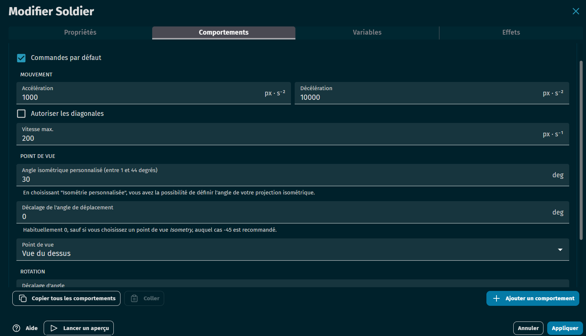
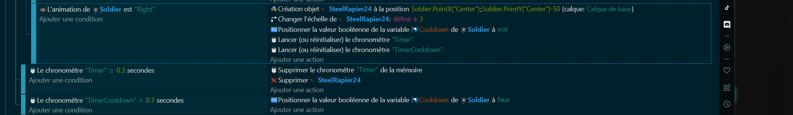
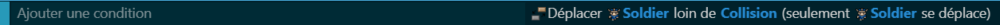
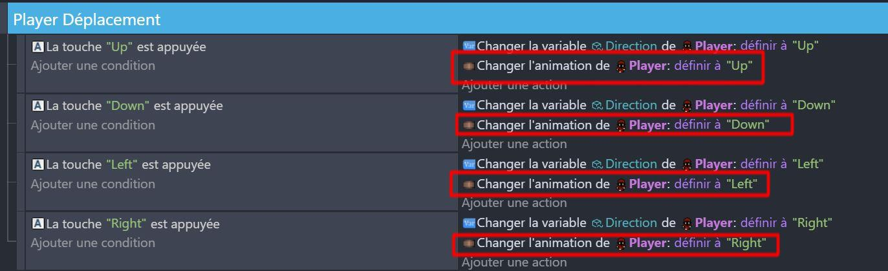

# Création du comportement du personnage 🏃‍♂️

Maintenant que nous avons notre monde, il est temps de donner vie à notre personnage. La création du comportement du personnage se fera en deux grandes parties : la définition des comportements et des variables, et l'écriture du code avec son animation.
   
## 1. Création du comportement de déplacement

Notre personnage va devoir hériter d'un [comportement](https://github.com/g404-code-gaming/GDevelop_Cour/blob/main/Comportement.md) **TopDownMouvement**, qui va lui permettre de se déplacer dans toutes les directions.

Modifier les paramètres du comportement pour qu'ils soient adapter à votre jeu. Vous pouvez, par exemple, modifier la vitesse, l'accélération/déccélération. 

Il faut cocher les *commandes par défaut* et décocher les *Tourner l'objet*. 

### Variables

Nous allons avoir besoin des [variables](https://github.com/g404-code-gaming/GDevelop_Cour/blob/main/Variables.md) suivante sur notre personnage : 

- CanHit : Détermine si le personnage possède une arme ou non. Il ne peut pas frapper si il n'a pas d'arme.
- Cooldown : Une variable qui détermine le temps que le personnage met avant de pouvoir frapper à nouveau.

# 2. Création du comportement d'attaque du personnage ⚔️

Maintenant que notre personnage peut se déplacer dans le monde, il est temps de lui donner la possibilité de se défendre contre les monstres. Pour cela, nous allons créer un comportement d'attaque pour notre personnage.

> Attention, dans le jeu, le personnage ne peut attaquer que s'il a ramassé une épée. Puisque nous avons besoin de l'épée pour faire nos tests, mettez la variable CanHit de votre Player à Vrai pour que le programme suivant fonctionne.

## Comportement et variables 📝

Le comportement d'attaque de notre personnage sera déclenché lorsque le bouton d'attaque est pressé. Lorsque cela se produit, notre personnage va créer une épée et l'agiter dans la direction dans laquelle il fait face. Pour contrôler ce comportement, nous allons définir la variable suivante sur notre personnage :

## Code 🖥️

Le code commence par vérifier si le bouton d'attaque est pressé et si le personnage est prêt à attaquer. 

Ensuite, le code vérifie la direction dans laquelle le personnage fait face. Selon la direction, une épée est créée à une position spécifique par rapport au personnage, et son échelle et son angle sont ajustés pour qu'elle pointe dans la bonne direction.

Après avoir créé l'épée, le personnage est mis en cooldown, ce qui signifie qu'il ne peut pas attaquer à nouveau immédiatement. Des timers sont utilisés pour contrôler le temps que l'épée reste à l'écran et le temps que le personnage reste en cooldown.

Si le timer atteint 0.3 seconde, l'épée est supprimée de l'écran. Cela donne l'illusion que le personnage agite son épée.

Si le timer de cooldown atteint 0.7 seconde, le personnage est autorisé à attaquer à nouveau. Cela empêche le personnage d'attaquer en continu et donne un rythme aux combats.

Voici le résultat que vous devriez atteindre :

Avec ce code, notre personnage peut maintenant attaquer les monstres et se défendre.

# 3. Gestion des collisions dans la carte 🚧

Pour rendre notre monde de jeu plus réaliste, nous devons empêcher notre personnage de se déplacer n'importe où. Par exemple, notre personnage ne devrait pas pouvoir marcher sur l'eau ou traverser les murs. Pour cela, nous allons gérer les collisions dans notre carte.

## Création d'un groupe d'objets 📚

La première étape consiste à créer un groupe d'objets qui regroupe tous les objets sur lesquels nous ne voulons pas que le personnage se déplace. Cela peut inclure des objets comme les murs, les arbres, les rochers, etc. Nous allons appeler ce groupe "Collision".

Pour créer un groupe d'objets dans GDevelop 5, tu peux suivre ces étapes :

Ouvre le gestionnaire d'objets.
Clique sur le bouton "+ Ajouter un groupe".
Nomme le groupe "Collision".
Ajoute tous les objets sur lesquels tu ne veux pas que le personnage se déplace à ce groupe.

## Code 🖥️

Une fois que nous avons notre groupe d'objets, nous pouvons écrire le code qui gère les collisions. Ce code sera exécuté à chaque frame du jeu pour vérifier si le personnage est en collision avec un objet du groupe "Collision". Si c'est le cas, le personnage sera empêché de se déplacer sur cet objet.

Voici à quoi pourrait ressembler ce code :

Avec ce code, notre personnage ne pourra pas se déplacer sur les objets du groupe "Collision", ce qui rendra notre monde de jeu plus réaliste et plus intéressant à explorer.

# BONUS : Animation du personnage 🏃‍♂️

Si votre personnage possède plusieurs animations (voir les propriétés de l'objet), il est possible de modifier son apparence en fonction des directions vers lesquels ils se déplace. 

Ajoutez les évènements suivants pour permettre à votre personnage d'adapter son animation en fonction de la touche de déplacement utilisée.

Dans la prochaine section, nous allons ajouter des monstres à notre monde de jeu et leur donner un comportement d'attaque. Alors prenez votre épée jeune guerrier !!

[Ennemis](https://github.com/g404-code-gaming/Zelda-Like-CodeGaming/blob/main/Cr%C3%A9ation-Du-Jeu/03_Ennemis.md)
