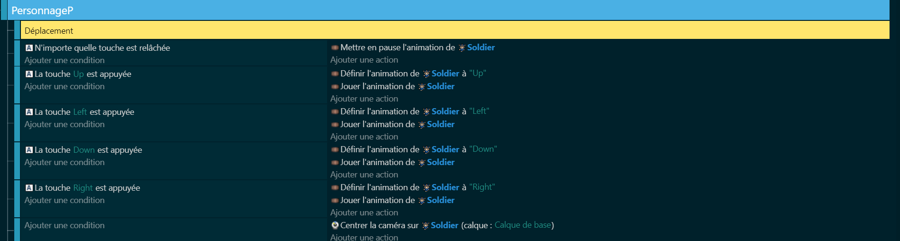

# Création du comportement du personnage 🏃‍♂️

Maintenant que nous avons notre monde de jeu, il est temps de donner vie à notre personnage. La création du comportement du personnage se fera en deux grandes parties : la définition des comportements et des variables, et l'écriture du code avec son animation.

# Comportements et variables 📝

 ## Comportement
Les comportements sont les actions que notre personnage peut effectuer, comme marcher, courir, sauter, attaquer, etc. Pour chaque comportement, nous devrons définir des variables qui contrôlent comment ce comportement fonctionne. Par exemple, pour le comportement de marche, nous pourrions avoir des variables pour la vitesse de marche, la direction de marche, etc.

Voici une liste des comportements et des variables que nous allons définir pour notre personnage :

1. Marcher : vitesse de marche, direction de marche
2. Attaquer : puissance de l'attaque, portée de l'attaque
3. Interagir : distance d'interaction, objet d'interaction
   
# 1. Création du comportement de déplacement

Notre personnage va devoir hériter d'un comportement "TopDownMouvement" Mais tout d'abord qu'est-ce qu'un top Down Mouvement?

Un top-down mouvement est un type de mouvement dans les jeux vidéo qui se caractérise par une vue aérienne inclinée vers le bas, des contrôles permettant de déplacer le personnage ou l'objet dans toutes les directions, et une utilisation courante dans une variété de genres de jeux pour offrir une perspective stratégique et une meilleure visibilité.

On aimerait que le personnage n'ait pas d'inertie. Pour cela, on va effectuer une forte accélération vers une vitesse maximum lorsque l'on déplace notre personnage et une forte décélération lorsqu'on relâchera une touche de déplacement.

## Variables

Pour l'instant, nous créerons seulement une variable qu'on appellera "PV" qui représentera notre nombre de vie de notre personnage. On reviendra plus tard dans les variables du personnage n'allons pas trop vite.

# Animation du personnage 🏃‍♂️

Maintenant, que notre personnage se déplace occupons-nous des animations. (Pour ma part, le personnage avait déjà les animations pré fait)

# 2. Création du comportement d'attaque du personnage ⚔️

Maintenant que notre personnage peut se déplacer dans le monde, il est temps de lui donner la possibilité de se défendre contre les monstres. Pour cela, nous allons créer un comportement d'attaque pour notre personnage.

## Comportement et variables 📝

Le comportement d'attaque de notre personnage sera déclenché lorsque le bouton d'attaque est pressé. Lorsque cela se produit, notre personnage va créer une épée et l'agiter dans la direction dans laquelle il fait face. Pour contrôler ce comportement, nous allons définir la variable suivante sur notre personnage :

**Cooldown** : Cette variable contrôle le temps entre chaque attaque. Après chaque attaque, notre personnage doit attendre un certain temps avant de pouvoir attaquer à nouveau.

**CanHit** : Cette variable pour ma part correspond a si l'épée a été ramassée ou non. (libre à vous de l'avoir dès le début du jeu ou le récupérer à un endroit)

## Code 🖥️

Le code commence par vérifier si le bouton d'attaque est pressé et si le personnage est prêt à attaquer. Si c'est le cas, un son d'attaque est joué pour donner un retour audio à l'utilisateur.

Ensuite, le code vérifie la direction dans laquelle le personnage fait face. Selon la direction, une épée est créée à une position spécifique par rapport au personnage, et son échelle et son angle sont ajustés pour qu'elle pointe dans la bonne direction.

Après avoir créé l'épée, le personnage est mis en cooldown, ce qui signifie qu'il ne peut pas attaquer à nouveau immédiatement. Des timers sont utilisés pour contrôler le temps que l'épée reste à l'écran et le temps que le personnage reste en cooldown.

Si le timer atteint 0.3 seconde, l'épée est supprimée de l'écran. Cela donne l'illusion que le personnage agite son épée.

Si le timer de cooldown atteint 0.7 seconde, le personnage est autorisé à attaquer à nouveau. Cela empêche le personnage d'attaquer en continu et donne un rythme aux combats.

Voici le résultat que vous devriez atteindre :

Avec ce code, notre personnage peut maintenant attaquer les monstres et se défendre.

# 3. Gestion des collisions dans la carte 🚧

Pour rendre notre monde de jeu plus réaliste, nous devons empêcher notre personnage de se déplacer n'importe où. Par exemple, notre personnage ne devrait pas pouvoir marcher sur l'eau ou traverser les murs. Pour cela, nous allons gérer les collisions dans notre carte.

## Création d'un groupe d'objets 📚

La première étape consiste à créer un groupe d'objets qui regroupe tous les objets sur lesquels nous ne voulons pas que le personnage se déplace. Cela peut inclure des objets comme les murs, les arbres, les rochers, etc. Nous allons appeler ce groupe "Collision".

Pour créer un groupe d'objets dans GDevelop 5, tu peux suivre ces étapes :

Ouvre le gestionnaire d'objets.
Clique sur le bouton "+ Ajouter un groupe".
Nomme le groupe "Collision".
Ajoute tous les objets sur lesquels tu ne veux pas que le personnage se déplace à ce groupe.

## Code 🖥️

Une fois que nous avons notre groupe d'objets, nous pouvons écrire le code qui gère les collisions. Ce code sera exécuté à chaque frame du jeu pour vérifier si le personnage est en collision avec un objet du groupe "Collision". Si c'est le cas, le personnage sera empêché de se déplacer sur cet objet.

Voici à quoi pourrait ressembler ce code :

Avec ce code, notre personnage ne pourra pas se déplacer sur les objets du groupe "Collision", ce qui rendra notre monde de jeu plus réaliste et plus intéressant à explorer.

Dans la prochaine section, nous allons ajouter des monstres à notre monde de jeu et leur donner un comportement d'attaque. Alors prenez votre épée jeune guerrier !!

[Ennemis](https://github.com/g404-code-gaming/Zelda-Like-CodeGaming/blob/main/Cr%C3%A9ation-Du-Jeu/03_Ennemis.md)
