# Création d'ennemis 🧟‍♂️

Maintenant que nous avons notre personnage et notre carte, il est temps d'ajouter des ennemis pour rendre notre jeu plus intéressant. Dans ce tutoriel, nous allons créer 3 types d'ennemis : BigDemon, RockHead, Necromancer.

Pour les plus rapides d'entre vous, le Angrypig sera en exercice bonus.

## Préparation des ennemis 

### groupe et variables

Tout les ennemis ont des points communs : ils vont tous blesser le joueur en le touchant, et tous ont des points de vie qu'ils vont perdre lorsqu'ils subissent des coups d'épée.

Créez le groupe **Ennemis**, dans lequel vous allez mettre tous vos ennemis.

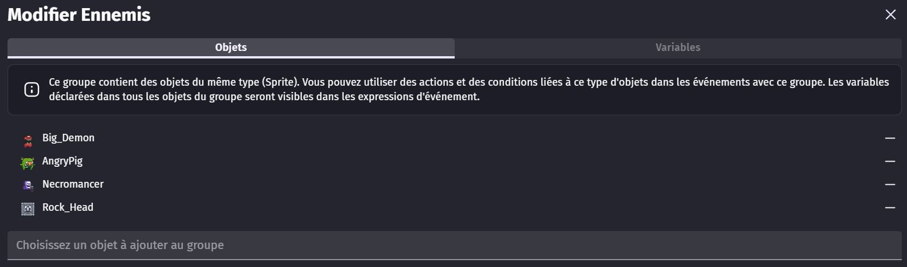

Dans les variables de ce groupe, ajoutez les **PV**, comme ça, tout les objets qui appartiennent à ce groupe ont des PV.

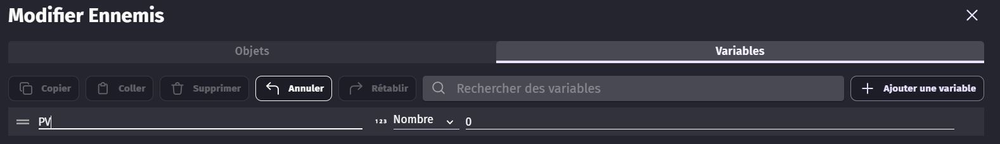

Une fois que cette variable est faite, allez dans les paramètres de chacun de vos ennemis et modifier la variable pour définir leurs PV. 

Exemple : 

| **Ennemi** | **PV** |
|---------------|---------------|
| Big Demon | 1 | 
| Rock Head | 3 | 
| Necromancer | 4 |
| Angry Pig | 6 | 

### Tuer les ennemis

Pour vaincre nos ennemis, nous allons avoir besoin de deux évènements : 
  - Un premier qui vérifie lorsque l'ennemi est en contact avec l'épée du joueur. ça lui fait perdre un PV.
  - Un deuxième qui vérifie si l'ennemi a 0 PV. Si oui, l'ennemi est supprimé.

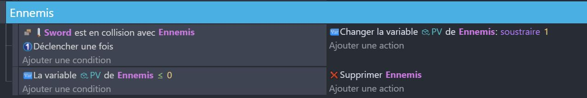

Tester ces évènements : placez des ennemis sur la scène et frappez-les avec votre épée pour vérifier si ils disparaissent au bout de quelques attaques.

AAA

## BigDemon 👹

BigDemon est un ennemi qui change de direction lorsqu'il heurte un mur. Cela signifie que si BigDemon se déplace vers la droite et heurte un mur, il commencera à se déplacer vers la gauche. C'est un ennemi de base facile à éviter et à tuer.

### Variable

il faut ajouter des variables supplémentaire au BigDemon : 

AAAAA

Direction : La direction dans laquelle BigDemon se déplace actuellement.
Moved : Un booléen qui indique si BigDemon a déjà changé de direction lors de la collision actuelle.

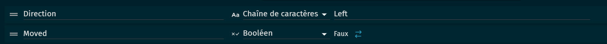

## Code 
Tout d'abord, nous allons nous occuper de ses déplacements, on aimerait que l'ennemi fasse seulement des mouvements de gauche à droite ou de haut en bas. BigDemon sera notre ennemi le plus faible et basique pour donner une approche croissante dans la difficulté du jeu afin de ne pas décevoir les joueurs de mourir ou de tomber directement sur un ennemi compliqué à tuer.

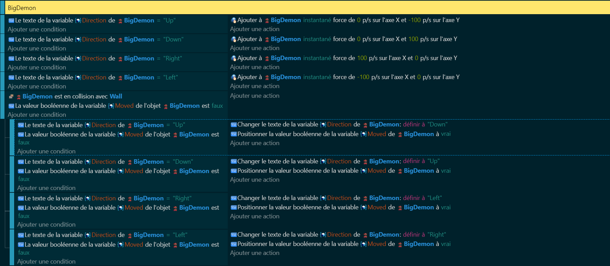

Ensuite nous allons gérer les événements tels que la collision avec l'épée pour tuer l'ennemi et s'il nous touche.

Tout d'abord, commençons par le plus simple, c'est-à-dire si l'épée est en collision avec l'ennemi, on va tout simplement le supprimer. Rien de plus simple !!

Par la suite, on va gérer la collision de notre ennemi avec notre personnage. Avant tout de chose pour éviter de perdre tous ces PV d'un seul coup, on va rajouter sur notre personnage une variable booléenne qui définira si on est en état d'invincibilité ou non.

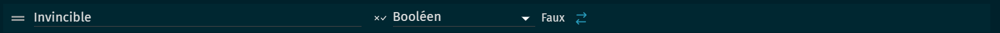

Puis maintenant retournons sur notre ennemi qui attend de pouvoir nous eliminer. Lors d'une collision de notre personnage contre l'ennemi, on fera perdre 1 PV à notre personnage et nous fera passer en état d'invincibilité pendant un certain temps.

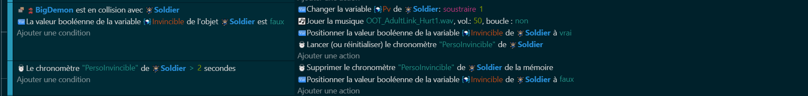

## RockHead 🪨

RockHead est un ennemi qui change d'animation lorsqu'il est touché. Cela signifie que lorsque le joueur attaque RockHead, l'animation de RockHead change pour montrer qu'il a été touché. De plus, la vie de RockHead est réduite chaque fois qu'il est touché. Si la vie de RockHead atteint 0, il est supposé être détruit.

## Variable

Hit : Un booléen qui indique si RockHead a été touché par une attaque.
Life : Le nombre de points de vie restants de RockHead.

## Code

Ce code commence par changer l'animation de RockHead à 1. Cela pourrait être l'animation que RockHead utilise lorsqu'il n'est pas en train d'être attaqué.

Ensuite, le code vérifie si l'épée du joueur (SteelRapier24) est en collision avec RockHead, si RockHead n'a pas déjà été touché (la variable Hit est False) et si RockHead a encore de la vie (la variable Life est supérieure à 0).

Si toutes ces conditions sont remplies, cela signifie que le joueur a réussi à attaquer RockHead. Le code réduit alors la vie de RockHead de 1 (ce qui représente les dégâts de l'attaque du joueur) et marque RockHead comme ayant été touché (la variable Hit devient True).

Et enfin lorsque RockHead n'a plus de vie on supprime l'objet.

Voici le résultat que vous devriez obtenir.

## Necromancien 💀

Necromancien est un ennemi qui tire un laser sur le joueur lorsqu'il est en charge. Cela signifie que lorsque Necromancien est en charge, il se déplace vers une position spécifique et tire un laser en direction du joueur. Cela rend Necromancien dangereux à distance, car il peut attaquer le joueur même s'il est loin de lui.

## Variables

Charge : Un booléen qui indique si Necromancien est en train de charger son attaque.
Cooldown : Un booléen qui permettra d'éviter les spams d'attaque.

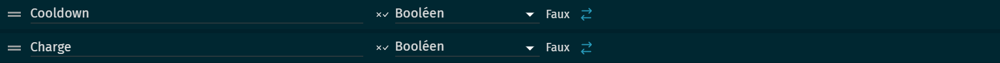

## Comportement

On va devoir lui rajouter un comportement de PathFinding c'est-à-dire que notre nécromancien vas chercher à rejoindre un endroit par n'importe quel chemin. 

## Code

Le Necromancien est un ennemi qui a la capacité de tirer un laser sur le joueur. Pour cela, il utilise une variable Charge qui indique s'il est en train de charger son attaque et une variable Cooldown qui représente le temps restant avant qu'il ne puisse à nouveau tirer son laser.

Le code vérifie si la variable Charge est True, ce qui signifie que le Necromancien est en train de charger son attaque. Si c'est le cas, le Necromancien définit sa destination de déplacement (Pathfinding) vers la position du joueur (Soldier), moins 20 pixels en X et Y. Cela fait en sorte que le Necromancien se déplace vers le joueur pour tirer son laser.

## AngryPig 🐷

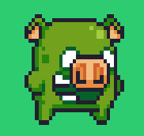

AngryPig est un ennemi qui charge le joueur lorsqu'il est en colère. Cela signifie que lorsque AngryPig est en colère, sa vitesse de déplacement augmente et il se dirige directement vers le joueur. Cela rend AngryPig plus dangereux lorsque le joueur l'attaque, car il peut rapidement se rapprocher du joueur et l'attaquer.

## Variable
Colère : Un booléen qui indique si AngryPig est en colère.
Direction : La direction actuelle d'AngryPig.
Life : Le nombre de points de vie restants d'AngryPig.
Moved : Un booléen qui indique si AngryPig a déjà changé de direction lors de la collision actuelle.

## Comportement 
Comme pour le nécromancien on va lui rajouter un comportement de PathFinding pour pouvoir chasser notre joueur lorsqu'il sera touché par l'épée.

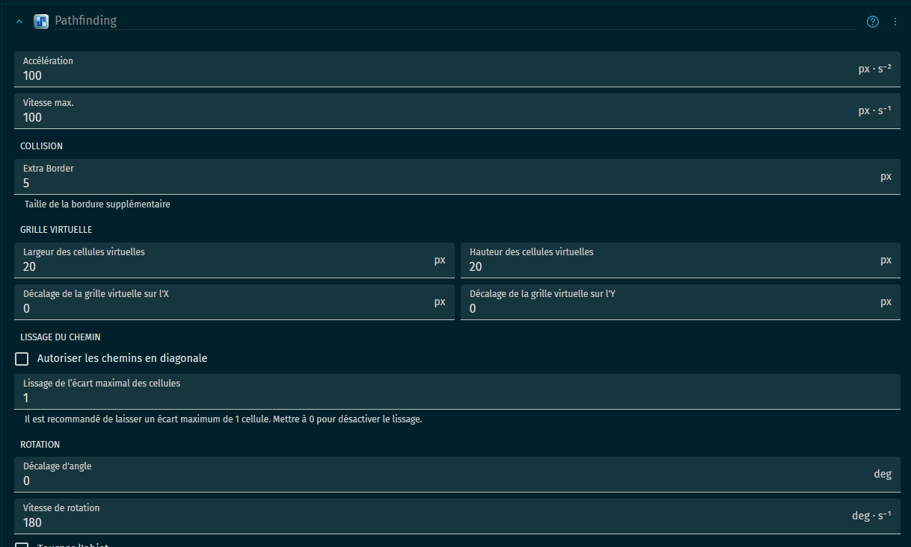

## Code
Pour la partie code de notre AngryPig on va le découper en plusieurs parties qui sont :

1. Les déplacements de base (hors colère)
2. Phase de combat (avec la colère)
3. La mort du AngryPig

### les déplacement de base (hors colère)
Pour ma part, j'ai choisi de les faire se déplacer comme les BigDemon sauf qu'ils iront que de haut en bas.

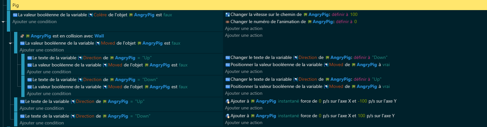

### Phase de combat (avec la colère)
Lorsque l'AngryPig rentrera en état de colère (frappée par l'épée) il changera totalement de style de déplacement tout d'abord, il s'arrêtera de bouger le temps de l'animation "Hit" puis ensuite ses déplacements seront focalisés sur le joueur, c'est-à-dire, il donnera tout pour vous toucher. Puis après un certain temps, on le fera se calmer et retourner à son état normal de Pig inoffensif.

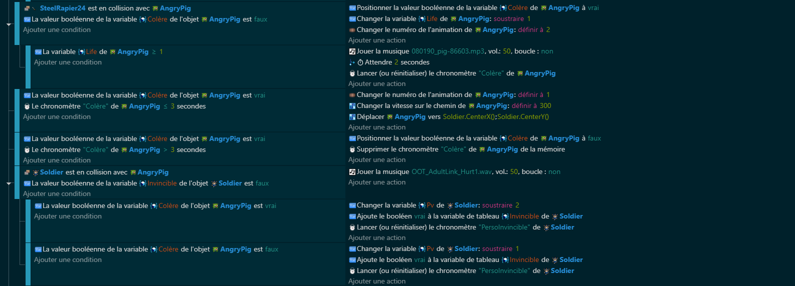

### La mort du AngryPig
Pour sa mort rien de plus simple on supprimera le AngryPig et pour récompenser le player on lui donnera un rubis

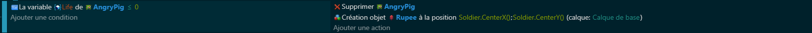

# Conclusion

Les ennemis dans ton jeu, comme AngryPig, BigDemon, RockHead et Necromancer, ont tous des comportements uniques qui les rendent intéressants et stimulants pour le joueur. Ils ont tous des variables qui déterminent leurs comportements, comme leur direction de déplacement, leur état d'humeur, leur vie et leur capacité à infliger des dégâts. Le code de chaque ennemi est conçu pour gérer ces variables et déterminer comment l'ennemi réagit aux actions du joueur, comme être touché par l'épée du joueur ou rencontrer un mur. En comprenant comment ces variables et ce code fonctionnent, tu peux créer des ennemis qui offrent des défis intéressants et variés pour le joueur.

Maintenant que nous avons examiné les ennemis, nous allons passer à l'interface utilisateur (UI). L'UI est un aspect crucial de tout jeu, car elle permet au joueur de comprendre ce qui se passe et de contrôler efficacement son personnage. Dans la prochaine section, nous allons examiner comment tu peux créer une UI efficace pour ton jeu.
[Lien vers UI](https://github.com/g404-code-gaming/Zelda-Like-CodeGaming/blob/main/Cr%C3%A9ation-Du-Jeu/04_UI.md)
