# Création d'ennemis 🧟‍♂️

Maintenant que nous avons notre personnage et notre carte, il est temps d'ajouter des ennemis pour rendre notre jeu plus intéressant. Dans ce tutoriel, nous allons créer 3 types d'ennemis : BigDemon, RockHead, Angrypig.

Pour les plus rapides d'entre vous, le Necromancer sera en exercice bonus.

## Préparation des ennemis 

### groupe et variables

Tout les ennemis ont des points communs : ils vont tous blesser le joueur en le touchant, et tous ont des points de vie qu'ils vont perdre lorsqu'ils subissent des coups d'épée.

Créez le groupe **Ennemis**, dans lequel vous allez mettre tous vos ennemis.

Dans les variables de ce groupe, ajoutez les **PV**, comme ça, tout les objets qui appartiennent à ce groupe ont des PV.

Une fois que cette variable est faite, allez dans les paramètres de chacun de vos ennemis et modifier la variable pour définir leurs PV. 

Exemple : 

| **Ennemi** | **PV** |
|---------------|---------------|
| Big Demon | 1 | 
| Rock Head | 3 | 
| Necromancer | 4 |
| Angry Pig | 6 | 

### Tuer les ennemis

Pour vaincre nos ennemis, nous allons avoir besoin de deux évènements : 
  - Un premier qui vérifie lorsque l'ennemi est en contact avec l'épée du joueur. ça lui fait perdre un PV.
  - Un deuxième qui vérifie si l'ennemi a 0 PV. Si oui, l'ennemi est supprimé.

Tester ces évènements : placez des ennemis sur la scène et frappez-les avec votre épée pour vérifier si ils disparaissent au bout de quelques attaques.

## BigDemon 👹

BigDemon est un ennemi qui change de direction lorsqu'il heurte un mur. Cela signifie que si BigDemon se déplace vers la droite et heurte un mur, il commencera à se déplacer vers la gauche. C'est un ennemi de base facile à éviter et à tuer.

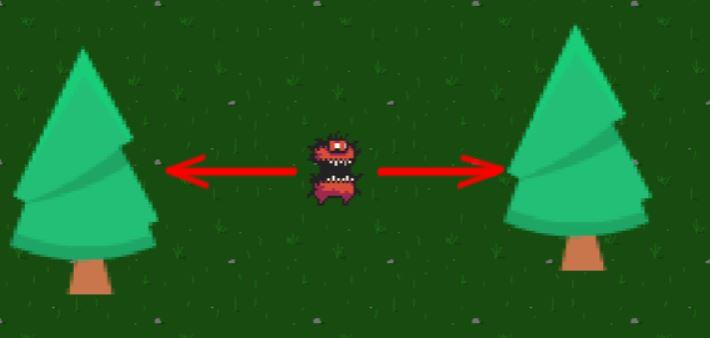

### Variable

il faut ajouter une variable supplémentaire au BigDemon :

Direction : La direction dans laquelle BigDemon se déplace actuellement.
Moved : Un booléen qui indique si BigDemon a déjà changé de direction lors de la collision actuelle.

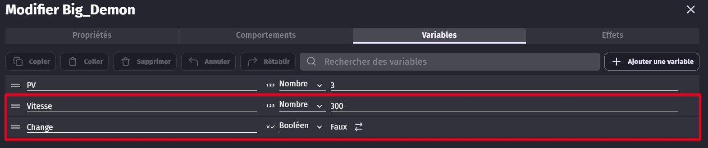

Cette variable définira la vitesse à laquelle il se déplace.

### Code 

Le déplacement du Big Demon fonctionne comme suis : 

  - En permanance, l'ennemi se déplace d'une vitesse égale à sa variable Vitesse. ça signifie que, si sa variable est négative, il va vers la gauche, sinon, il va vers la droite.
  - Ensuite, un évènement vérifie lorsqu'il entre en colision avec un obstacle. Si oui, le Big Demon inverse sa vitesse : cela lui fait changer de direction.

> Le programme "Pour chaque instance de" peut être trouvé dans les options de l'évènement --> Ajouter --> Pour chaque objet.

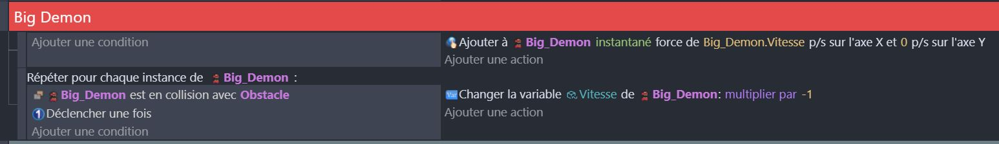

## RockHead 🪨

RockHead est un ennemi immobile qui bloque le chemin du joueur. Il a la particularité de changer d'animation lorsqu'il est frappé par le joueur.

Pour que le joueur ne puisse pas traverser le RockHead : ajoutez RockHead à la liste des **Obstacles**

### Code

Lorsque RockHead est en collision avec l'épée du joueur, il déclenche une animation spéciale "Hit" pendant un court instant.

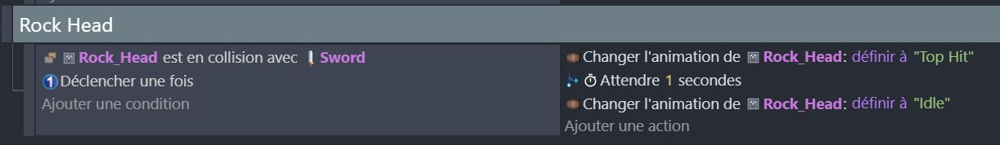

Le but du RockHead est d'être un obstacle statique pour le joueur. Afin qu'il bloque réellement le passage, vous pouvez l'ajouter au groupe des obstacles vus au chapitre précédent : ainsi, il empéchera le joueur de passer. 

## AngryPig 🐷

AngryPig est un ennemi aggressif qui se met à poursuivre le joueur dés qu'il le vois. C'est un défi important, car il oblige le joueur à être réactif et à le fuir. 

## Comportement 

Pour rendre les déplacements du Angrypig plus fluide, nous allons utiliser le comportement **Pathfinding** (Recherche de chemin). 

Ce comportement permet à l'ennemi d'éviter les obstacles et se diriger directement vers la position souhaitée (en l'occurence, le joueur). 

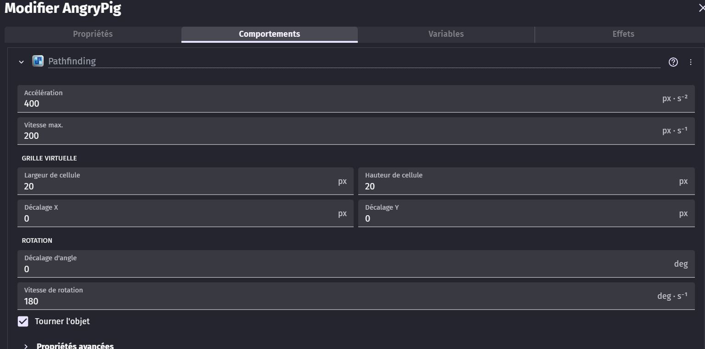

Ce comportement va gérer les déplacements du Angrypig au lieu d'utiliser des forces.

Dans les paramètres : Décochez la case **Tournez l'objet**.

Pour qu'il fonctionne, il faut que chaque obstacle du jeu (ceux appartenant au groupe d'obstacle, reçoivent également un comportement : l'Obstacle à la recherche de chemin.

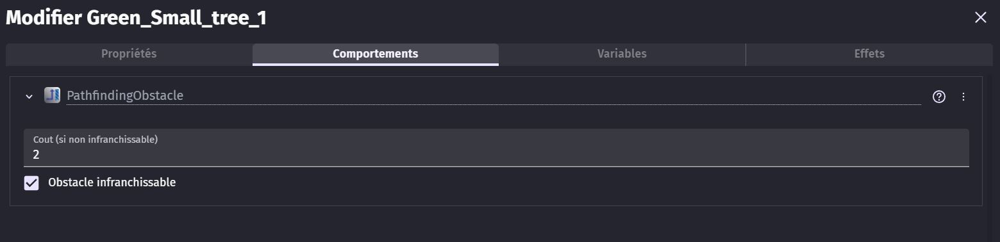

### Programme 

## BONUS : Necromancien 💀

Necromancien est un ennemi de milieu de niveaux qui se dirige vers le joueur lorsqu'il est proche et lui tire des laser. 

C'est un ennemi particulièrement dangereux, qui attaque à distance. Il peut donc attaquer le joueur de loin et le blesser sans que ce dernier puisse contre-attaquer. La meilleure méthode pour le vaincre consiste à renvoyer ses projectiles. 

### Fonctionnement 

Le Nécromancien se déplace vers le joueur lorsqu'il se trouve à une distance correcte. 
Lorsqu'il entre à portée d'attaque, il s'arrête et commence à charger un projectile pendant un court instant, visant le joueur. Lorsque le chargement est complet, le Nécromancien lance son projectile vers le joueur. 

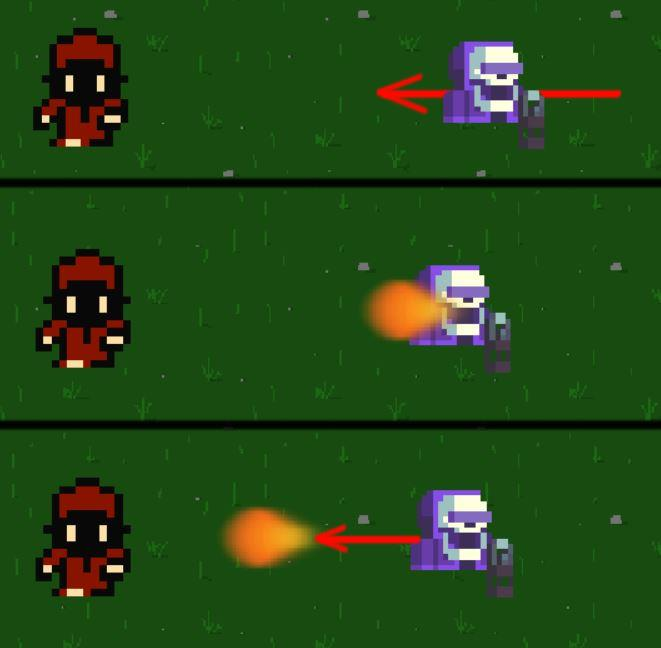

### Variables

Le Nécromancien a besoin d'une variable **Cooldown**, qui permettra de savoir s'il est en train de tirer ou non. 

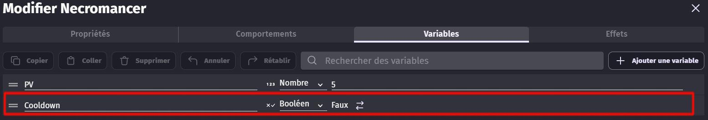

## Programme

Pour commencer, il faut permettre au Nécromancien de se déplacer lorsque le Player entre à portée de vue. 
Il ne se déplace pas si il se trouve trop près du joueur, ou s'il est en train de tirer. 

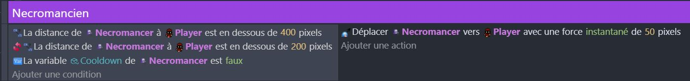

Ensuite, lorsqu'il se trouve à portée du Player, il s'arrête et invoque un projectile. Pour gérer correctement la charge du projectile, nous utilisons des **Chronomètres**.

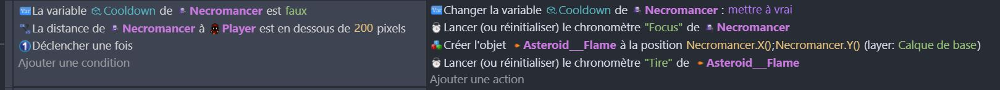

Pour que le projectile parte après un court chargement, et que le Nécromancien puisse tirer à nouveau, on crée deux évènements qui sont activé en fonction des chronomètres créés plus tôt : celui du projectile lui permet de se diriger vers le Player, et celui du Nécromancien lui permet de tirer à nouveau. 

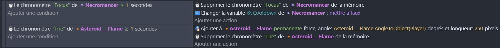

Testez votre Nécromancien pour vérifier qu'il fonctionne comme prévus : vérifiez qu'il approche votre joueur et s'arrête pour tirer des projectiles. 

### Bonus : orienter le projectile vers le joueur 

Si vous souhaitez que le projectile s'oriente vers le joueur pendant le chargement, pour donner l'impression que le Nécormancien vise sa cible, ajoutez l'évènement suivant qui modifie l'angle du projectile. 

## Renvoyer les projectiles 

Pour vaincre facilement le Nécromancien, il faut lui renvoyer ses projectiles dans la figure. 

Pour des raisons de programme, nous allons plutôt procéder comme suis : 

  > Lorsque le Player touche une flamme avec son épée, il détruit la flamme et invoque une flamme "alliée" à la place. Cette flamme part dans la direction opposée, donnant l'impression qu'elle a été renvoyée.

Dupliquez donc votre projectile et renommez-le pour faire comprendre qu'il s'agit de celui de votre personnage.

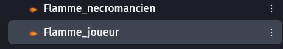

### Programme 

L'évènement de renvois des projectile consiste à invoquer un nouveau projectile à la position de celui de l'ennemi, supprimer le projectile ennemi, puis lancer le projectile allié : 

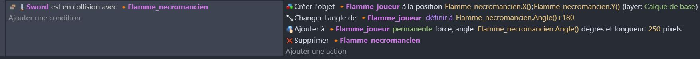

Pour finir, faites que les projectiles se suppriment en touchant leur cible respective.

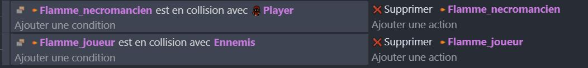

Créez le groupe **Projectile**, dans lequel vous mettrez tout les projectiles. Ces derniers sont détruit lorsqu'ils touchent des éléments du décors. 

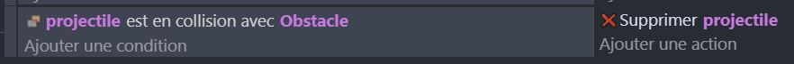

Pour l'instant, les projectiles ne font pas de dégât.
  - Pour les projectiles ennemis, nous verrons ça plus tard, lorsque nous traiterons les Point de vie du personnage et la barre de vie.
  - Pour ceux du joueur :

Pour simplifier le programme et éviter de refaire plusieurs fois les mêmes évènements, nous allons créer un groupe "Attaque" dans lequel nous allons mettre tout les objet utilisés par le joueur pour attaquer. 

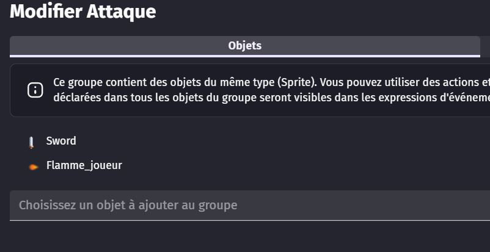

Modifiez ensuite l'évènement d'attaque : remplacez l'épée par le groupe d'attaque.

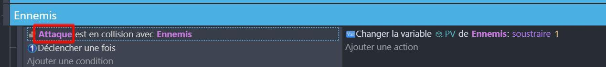

Désormais, les projectiles du joueur blessent correctement les ennemis. 

# Conclusion

Les ennemis dans ton jeu, comme AngryPig, BigDemon, RockHead et Necromancer, ont tous des comportements uniques qui les rendent intéressants et stimulants pour le joueur. Ils ont tous des variables qui déterminent leurs comportements, comme leur direction de déplacement, leur état d'humeur, leur vie et leur capacité à infliger des dégâts. Le code de chaque ennemi est conçu pour gérer ces variables et déterminer comment l'ennemi réagit aux actions du joueur, comme être touché par l'épée du joueur ou rencontrer un mur. En comprenant comment ces variables et ce code fonctionnent, tu peux créer des ennemis qui offrent des défis intéressants et variés pour le joueur.

Maintenant que nous avons examiné les ennemis, nous allons passer à l'interface utilisateur (UI). L'UI est un aspect crucial de tout jeu, car elle permet au joueur de comprendre ce qui se passe et de contrôler efficacement son personnage. Dans la prochaine section, nous allons examiner comment tu peux créer une UI efficace pour ton jeu.
[Lien vers UI](https://github.com/g404-code-gaming/Zelda-Like-CodeGaming/blob/main/Cr%C3%A9ation-Du-Jeu/04_UI.md)
