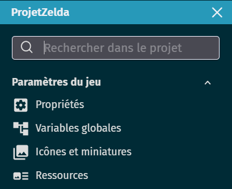
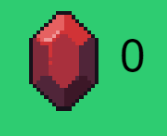

# Point de vie et UI 

Dans ce chapitre, nous allons ajouter tout ce qu'il faut pour que le personnage puisse perdre des Point de vie et mourir dans le jeu. 

## Point de vie

### Variables et groupes 

Pour commencer, il faut initialiser les points de vie du personnage. 

Puisqu'il pourra être déplacé d'un niveau à l'autre, notre personnage dois avoir des point de vie en variables globales. 

> Pour trouver où sont les variables globales, retournez voir le [ cours des variables](https://github.com/g404-code-gaming/GDevelop_Cour/blob/main/Variables.md)

Nous auront besoin de trois variables : 

- PV max : les PV que possède notre personnage au départ. Lorsqu'il meurre ou que le joueur relance la partie, le personnage possède ce nombre de PV.

- PV actuel : la véritable valeur de PV du personnage : c'est la quantité de point de vie qu'il a en jeu. Si ces PV actuels tombent à 0, il meurre.

- Barre PV : une variable qui servira pour la partie UI.

 

Ensuite, créer le Groupe **Danger**. Un Groupe qui contiendra tout les objets du jeu qui font perdre des point de vie au personnage du joueur en le touchant (cela inclue la plupart des ennemis, mais aussi les projectiles ou les éventuels pièges)

 

### Programme 

Ajoutez les deux évènements permettant de faire fonctionner la perte de point de vie et la mort du personnage. 

Lorsque le personnage meurre, on relance la scène en cours pour faire recommencer le joueur. 

 

Après avoir ajouté ces évènement, testez votre jeu pour voir si il fonctione correctement. 

### BONUS - information visuelle des dégâts 

Comme exercice bonus, essayez d'ajouter un effet visuel quand votre personnage subit des dégâts : c'est un bon moyen d'indiquer au joueur ce qu'il se passe. 

**Exemples** : 
- Faire apparaître un explosion ou un symbole 'Hit' à proximité de votre personnage quand il se fait toucher.
- Couvrir l'écran de rouge quand votre personnage se fait toucher.
- le rendre temporairement transparent quand il se fait toucher.

____

## Interface Utilisateur (UI) 

L'interface utilisateur, ou UI, est un aspect essentiel de tout jeu. Elle est l'intermédiaire entre le joueur et le jeu lui-même, fournissant des informations essentielles et permettant au joueur de contrôler le jeu. 

C'est grâce à l'UI que nous pouvons afficher, par exemple, les points de vie, le temps restant, l'arme équipée, des informations sur les contrôles, ect....

En l'occurence, il nous servira à afficher trois informations : 
- Les Point de vie actuels de notre personnage
- Les pièces d'Or possédées par notre personnage
- Les Clés possédée par notre personnage

 

### Préparer le terrain 

### Calque 

Pour faire un interface, il faut créer un nouveau calque **UI**.

 

Ce calque sera comme une couche invisible par dessus le jeu, qui nous permettra de faire apparaître des objets que ne seront pas physiquement avec les autres (parfait pour un interface !). 

### Placement des objets de calque 

Tu as remarqué que les objets qui apparaissent sur le calque ressemble à ceux que le joueur peut rammasser en jeu. 
En fait, si ils se ressemblent, ce sont en fait deux objets différents : le premier peut être rammassé dans le niveau, l'autre sers à apparaître sur l'UI.

Duplique tes objets **Heart**, **Gold** et **Key** pour avoir de nouveaux objets : Gold_UI, Heart_UI et Key_UI.

Crée ensuite deux nouveaux objets de type **texte** : Text_Gold et Text_Key.

Ces textes servirons à afficher les pièces d'or et les clés du joueur. 

Place-le ensuite tout tes nouveaux objets sur la scène de manière à ce qu'ils soient visible dans la caméra **ET** fassent partie du calque UI. 

AAAAAAAAAAAAAAA

 

## Système de PV 🍎

Pour gérer les points de vie du joueur dans notre jeu, nous allons créer un calque spécifique pour l'interface utilisateur, que nous appellerons "UI". Ce calque sera utilisé pour afficher les informations relatives aux points de vie du joueur.

Nous allons ensuite créer un objet qui représente un point de vie. Cet objet pourrait être une simple icône de cœur, ou tout autre symbole que tu juges approprié.

Une fois que nous avons notre objet PV, nous allons le dupliquer autant de fois que le nombre de points de vie que nous voulons donner au joueur. Par exemple, si nous voulons que le joueur commence avec 3 points de vie, nous allons créer 3 copies de notre objet PV sur le calque UI.

Ces objets PV seront disposés de manière à ce qu'ils soient facilement visibles pour le joueur. Par exemple, ils pourraient être alignés en haut de l'écran.

Lorsque le joueur perd un point de vie, nous supprimons simplement un des objets PV du calque UI ou ferons apparaître pour ma part une pomme noire (Changement d'animation). De cette façon, le nombre d'objets PV visibles sur l'écran correspond toujours au nombre de points de vie restants du joueur.

### Code 💻

Pour la partie code, j'ai choisi de changer les animations de mes pommes pour savoir le nombre de PV restant.
Nous reprendrons notre variable PV du Personnage et en fonction de sa valeur, on affichera à l'écran le nombre de PV restant.

## Système de Rubis 💎

Dans notre jeu, les rubis serviront de monnaie. Le joueur pourra collecter des rubis en jouant, et ces rubis pourront être utilisés pour acheter des objets ou des améliorations.

Pour afficher le nombre de rubis que le joueur a collecté, nous allons d'abord placer un objet rubis sur le calque "UI". Cet objet servira d'icône pour représenter les rubis dans l'interface utilisateur.

Ensuite, nous allons créer une variable globale "Rubis" pour le jeu. Cette variable sera utilisée pour garder une trace du nombre total de rubis que le joueur a collecté. Chaque fois que le joueur collecte un rubis dans le jeu, nous augmenterons la valeur de cette variable de 1.

Enfin, nous allons créer un objet de type texte sur le calque "UI". Cet objet affichera la valeur actuelle de la variable "Rubis", permettant ainsi au joueur de voir combien de rubis il a collecté.

En combinant ces éléments, nous pouvons créer un système de rubis qui est à la fois visuellement attrayant et facile à comprendre pour le joueur.

[Lien Item](https://github.com/g404-code-gaming/Zelda-Like-CodeGaming/blob/main/Cr%C3%A9ation-Du-Jeu/05_Item.md)
