# Point de vie et UI 

Dans ce chapitre, nous allons ajouter tout ce qu'il faut pour que le personnage puisse perdre des Point de vie et mourir dans le jeu. 

## Point de vie

### Variables et groupes 

Pour commencer, il faut initialiser les points de vie du personnage. 

Puisqu'il pourra être déplacé d'un niveau à l'autre, notre personnage dois avoir des point de vie en variables globales. 

> Pour trouver où sont les variables globales, retournez voir le [ cours des variables](https://github.com/g404-code-gaming/GDevelop_Cour/blob/main/Variables.md)

Nous auront besoin de trois variables : 

- PV max : les PV que possède notre personnage au départ. Lorsqu'il meurre ou que le joueur relance la partie, le personnage possède ce nombre de PV.

- PV actuel : la véritable valeur de PV du personnage : c'est la quantité de point de vie qu'il a en jeu. Si ces PV actuels tombent à 0, il meurre.

- Barre PV : une variable qui servira pour la partie UI.

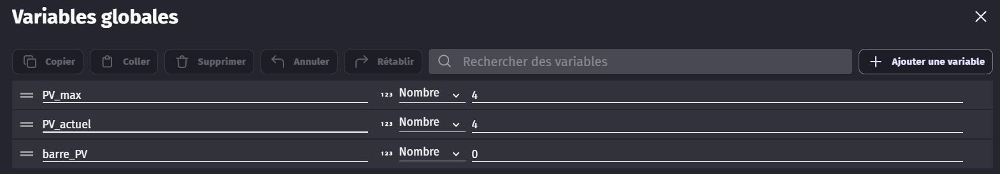 

Ensuite, créer le Groupe **Danger**. Un Groupe qui contiendra tout les objets du jeu qui font perdre des point de vie au personnage du joueur en le touchant (cela inclue la plupart des ennemis, mais aussi les projectiles ou les éventuels pièges)

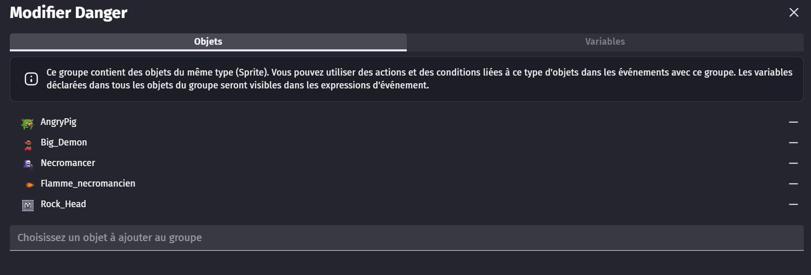 

Pour finir, ajouter une nouvelle variable **Invincible** pour votre personnage. 
Il s'agit d'une variable booléenne Fausse, qui servira à rendre notre personnage temporairement invincible en subissant des dégâts. 

### Programme 

Ajoutez les deux évènements permettant de faire fonctionner la perte de point de vie et la mort du personnage. 

Lorsque le personnage meurre, on relance la scène en cours pour faire recommencer le joueur. 

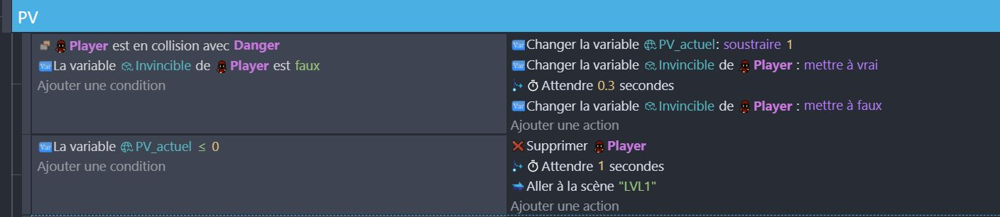 

Pour remettre les PV à leur valeur initiales, ajoutez l'évènement suivant: 

Après avoir ajouté ces évènement, testez votre jeu pour voir si il fonctione correctement. 

### BONUS - information visuelle des dégâts 

Comme exercice bonus, essayez d'ajouter un effet visuel quand votre personnage subit des dégâts : c'est un bon moyen d'indiquer au joueur ce qu'il se passe. 

**Exemples** : 
- Faire apparaître un explosion ou un symbole 'Hit' à proximité de votre personnage quand il se fait toucher.
- Couvrir l'écran de rouge quand votre personnage se fait toucher.
- le rendre temporairement transparent quand il se fait toucher.
____

## Interface Utilisateur (UI) 

L'interface utilisateur, ou UI, est un aspect essentiel de tout jeu. Elle est l'intermédiaire entre le joueur et le jeu lui-même, fournissant des informations essentielles et permettant au joueur de contrôler le jeu. 

C'est grâce à l'UI que nous pouvons afficher, par exemple, les points de vie, le temps restant, l'arme équipée, des informations sur les contrôles, ect....

En l'occurence, il nous servira à afficher trois informations : 
- Les Point de vie actuels de notre personnage
- Les pièces d'Or possédées par notre personnage
- Les Clés possédée par notre personnage

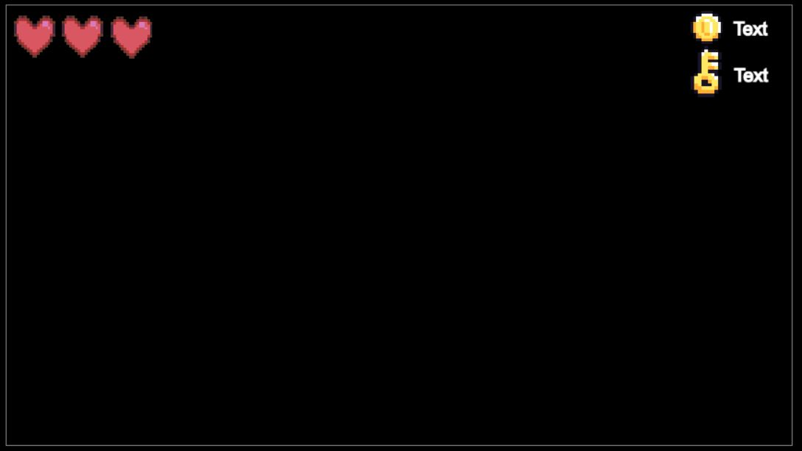 

### Préparer le terrain 

### Calque 

Pour faire un interface, il faut créer un nouveau calque **UI**.

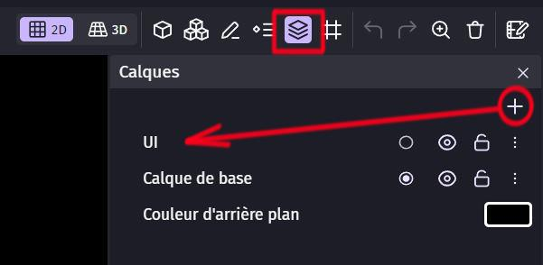 

Ce calque sera comme une couche invisible par dessus le jeu, qui nous permettra de faire apparaître des objets que ne seront pas physiquement avec les autres (parfait pour un interface !). 

### Placement des objets de calque 

Tu as remarqué que les objets qui apparaissent sur le calque ressemble à ceux que le joueur peut rammasser en jeu. 
En fait, si ils se ressemblent, ce sont en fait deux objets différents : le premier peut être rammassé dans le niveau, l'autre sers à apparaître sur l'UI.

Duplique tes objets **Heart**, **Gold** et **Key** pour avoir de nouveaux objets : Gold_UI, Heart_UI et Key_UI.

Créez ensuite deux nouveaux objets de type **texte** : **Text_Gold** et **Text_Key**.

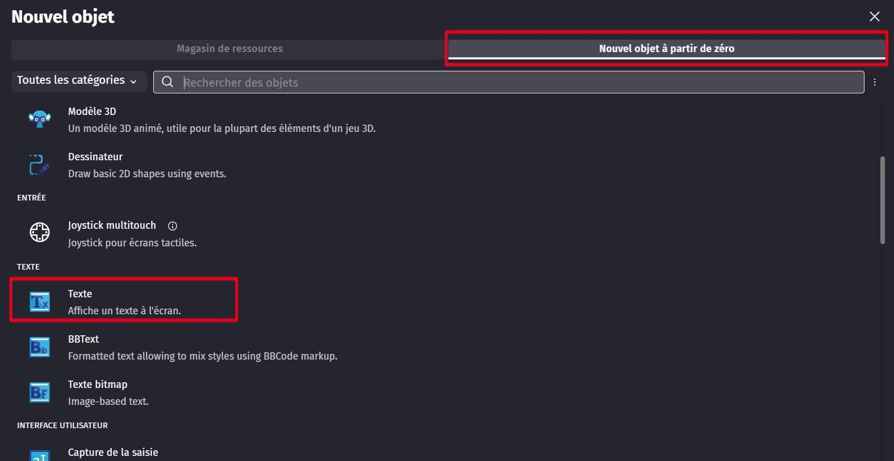 

Ces textes servirons à afficher les pièces d'or et les clés du joueur. 

Placez ensuite tout vos nouveaux objets sur la scène de manière à ce qu'ils soient visible dans la caméra. 

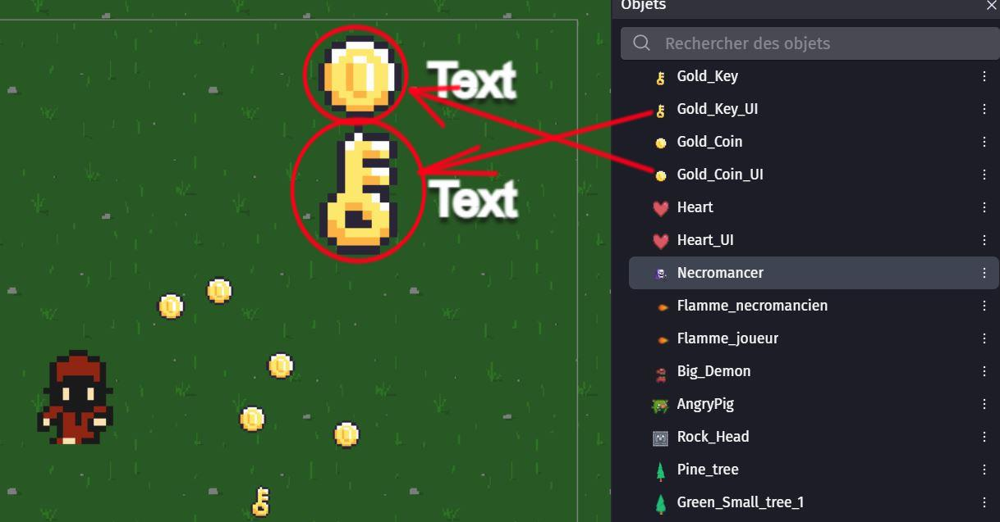 

Chaque objet de l'UI doit être placée dans le calque UI : 

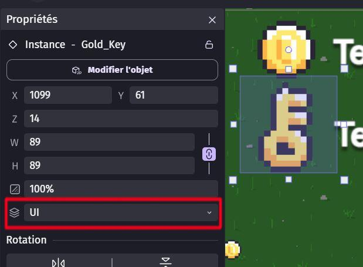 

Vous pouvez vérifier que les objets fonctionnent comme prévus en lançant l'aperçus. 

A ce stade du projet, les valeurs des textes sont vide et les PV n'apparaissent pas correctement quand on subie des dégâts : c'est normal. 

Il faut seulement vérifier que les éléments du UI soient bien placés et qu'ils bougent en même temps que le personnage. 

## Interface des PV 🍎

Pour gérer les points de vie du joueur dans notre jeu, nous allons utiliser une méthode permettant de faire apparaître une ligne de Coeurs représentant les PV du personnage. 

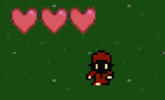 

Ces coeurs n'apparaissent pas par défaut dans la scène : nous allons utiliser une série d'évènement pour qu'ils apparaissent et disparaissent à chaque fois que le personnage gagne ou perd des PV. 

C'est ici qu'entre en scène la variable **barre_PV** que nous avons crée plus tôt. 

Pour commencez, au lancement de la scène, il faux définir les point de vie du joueur et mettre à jour la variable barre_PV.

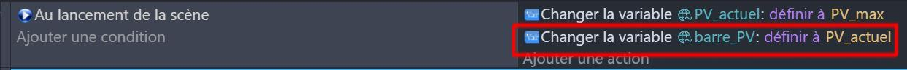 

Ensuite, modifier le code de perte de point de vie pour qu'il modifie l'affichage des coeurs et la barre_PV.

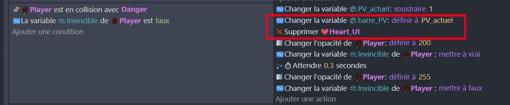 

Enfin, ajoutez le programme qui affiche (ou ré-affiche) les coeurs sur l'UI en fonction de la valeur de barre_PV. 

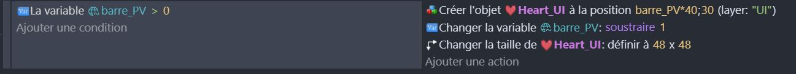 

> Attention : les Coeurs sont crée sur le calque UI (cf. la partie verte dans le code ci-dessus)

Si les coeurs n'apparaissent pas exactement comme vous le souhaitez, modifier les valeurs X et Y d'apparition et changez leur taille. 

Une fois les évènements terminés, testez votre jeu pour voir si les coeurs apparaissent et réapparaissent correctement après avoir subie des dégâts.

## Or et clé 💎

Dans notre jeu, l'or servira de monnaie. L'or servira plus tard pour satisfaire des PNJ afin qu'ils nous laisse passer. 

Les Clés, quand à elle, serviront à ouvrir les portes fermées. Ce sera grâce à une clé que nous entrerons dans le donjon. 

### Variables 

Ajoutez les variables globales Gold_Player et Key_Player. 

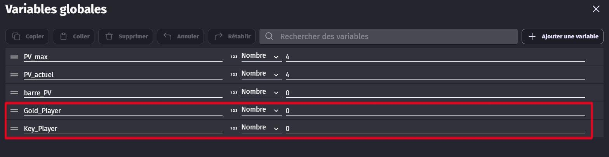 

> NOTE : il ne faut pas leur mettre le même nom que les objets **Gold** et **Key** : cela peut provoquer des erreurs dans les évènements

### Programme 

Dans les évènements, ajoutez un évènement sans condition qui met à jour les textes de GoldText et KeyText en fonction de la valeur des variables précédentes : 

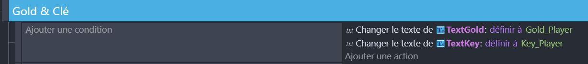 

Ensuite, ajoutez, pour chaque objet, l'évènement qui permet de le "ramasser" : lorsque le personnage du joueur entre en contact avec l'objet précieux, il augmente la variable associée et supprime l'objet.

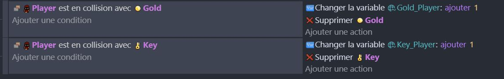 

Testez votre programme pour vérifier que vous pouvez rammasser les clés et les pièces d'Or. 

Avec tout ça, vous avez vus les bases d'un Interface Utilisateur et avez ajouté ce qu'il fallait pour avoir un jeu d'aventure jouable. 

[Partie 5 - Items](https://github.com/g404-code-gaming/Zelda-Like-CodeGaming/blob/main/Cr%C3%A9ation-Du-Jeu/05_Item.md)
