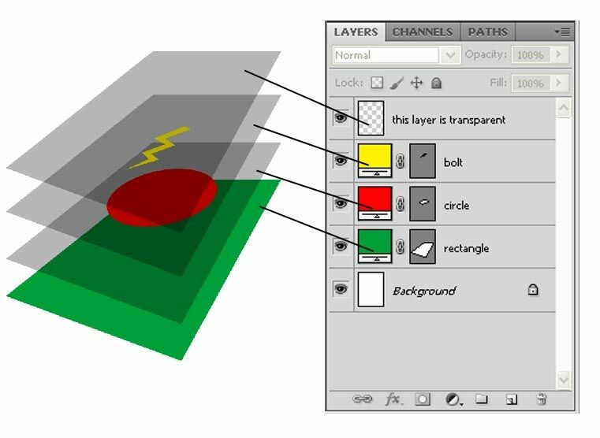

# UI 

L'interface utilisateur, ou UI, est un aspect essentiel de tout jeu. Elle est l'intermédiaire entre le joueur et le jeu lui-même, fournissant des informations essentielles et permettant au joueur de contrôler le jeu. Une bonne UI est claire, intuitive et donne au joueur toutes les informations dont il a besoin sans être encombrante ou distrayante.

Dans ton jeu, nous allons diviser l'UI en deux systèmes principaux : un pour les points de vie (PV) et un pour les rubis.

1. Utilisation de Calque : introduction à la bonne utilisation des calques + à quoi servent-ils.

2. Système de PV : Ce système affiche le nombre actuel de points de vie du joueur. C'est une information cruciale, car elle indique au joueur combien de dégâts il peut encore subir avant de perdre. Le système de PV doit être facile à comprendre et à lire rapidement, même en plein combat.

3. Système de Rubis : Ce système affiche le nombre actuel de rubis que le joueur a collecté. Les rubis nous servirons pour un passage du jeux plus tard. Comme le système de PV, le système de rubis doit être clair et facile à lire.

En combinant ces deux systèmes, nous pouvons créer une UI qui donne au joueur toutes les informations dont il a besoin pour jouer efficacement. Dans les prochaines sections, nous allons examiner comment mettre en œuvre ces systèmes dans ton jeu.

## Les Calques

Dans GDevelop, les calques sont utilisés pour organiser les objets sur la scène. Ils fonctionnent un peu comme des couches dans un logiciel de graphisme : tu peux avoir plusieurs calques, et les objets sur un calque supérieur apparaîtront au-dessus des objets sur un calque inférieur.

Cela peut être très utile pour créer des effets de profondeur dans ton jeu. Par exemple, tu pourrais avoir un calque pour le ciel, un autre pour les bâtiments en arrière-plan, un autre pour les personnages et les objets interactifs, et un autre pour l'interface utilisateur.

Dans ton jeu, tu utiliseras probablement au moins deux calques pour l'interface utilisateur : un pour le système de points de vie et un pour le système de rubis. Cela te permettra de contrôler précisément où ces éléments apparaissent à l'écran et de t'assurer qu'ils sont toujours visibles pour le joueur.

Il est important de noter que les calques sont aussi utilisés pour déterminer l'ordre de rendu des objets. Les objets sur un calque supérieur sont rendus après les objets sur un calque inférieur, ce qui signifie qu'ils apparaîtront au-dessus des objets sur les calques inférieurs.

## Système de PV 

Pour gérer les points de vie du joueur dans notre jeu, nous allons créer un calque spécifique pour l'interface utilisateur, que nous appellerons "UI". Ce calque sera utilisé pour afficher les informations relatives aux points de vie du joueur.

Nous allons ensuite créer un objet qui représente un point de vie. Cet objet pourrait être une simple icône de cœur, ou tout autre symbole que tu juges approprié.

Une fois que nous avons notre objet PV, nous allons le dupliquer autant de fois que le nombre de points de vie que nous voulons donner au joueur. Par exemple, si nous voulons que le joueur commence avec 3 points de vie, nous allons créer 3 copies de notre objet PV sur le calque UI.

Ces objets PV seront disposés de manière à ce qu'ils soient facilement visibles pour le joueur. Par exemple, ils pourraient être alignés en haut de l'écran.

Lorsque le joueur perd un point de vie, nous supprimons simplement un des objets PV du calque UI ou ferons apparaître pour ma part une pomme noire (Changement d'animation). De cette façon, le nombre d'objets PV visibles sur l'écran correspond toujours au nombre de points de vie restants du joueur.

### Code

Pour la partie code, j'ai choisi de changer les animations de mes pommes pour savoir le nombre de PV restant.
Nous reprendrons notre variable PV du Personnage et en fonction de sa valeur, on affichera à l'écran le nombre de PV restant.

## Système de Rubis

Dans notre jeu, les rubis serviront de monnaie. Le joueur pourra collecter des rubis en jouant, et ces rubis pourront être utilisés pour acheter des objets ou des améliorations.

Pour afficher le nombre de rubis que le joueur a collecté, nous allons d'abord placer un objet rubis sur le calque "UI". Cet objet servira d'icône pour représenter les rubis dans l'interface utilisateur.

Ensuite, nous allons créer une variable globale "Rubis" pour le jeu. Cette variable sera utilisée pour garder une trace du nombre total de rubis que le joueur a collecté. Chaque fois que le joueur collecte un rubis dans le jeu, nous augmenterons la valeur de cette variable de 1.

Enfin, nous allons créer un objet de type texte sur le calque "UI". Cet objet affichera la valeur actuelle de la variable "Rubis", permettant ainsi au joueur de voir combien de rubis il a collecté.

En combinant ces éléments, nous pouvons créer un système de rubis qui est à la fois visuellement attrayant et facile à comprendre pour le joueur.
