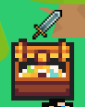
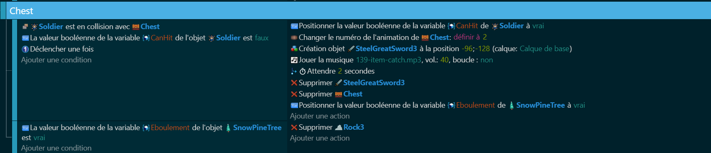

# Items et évènements 

Nous avons l'essentiel pour le jeu Zelda-Like. Maintenant, nous allons ajouter des nouveaux éléments pour améliorer le jeu. 

## Coffre pour l'épée

Au début du jeu, notre joueur n'a pas accès à l'épée et ne peut pas se défendre. Il dois trouver l'épée dans un coffre. 
Nous allons inclure un coffre au trésor que le joueur peut ouvrir pour obtenir une épée. 

Si ce n'est pas déjà fait : **ajoutez un objet Coffre au trésor dans votre jeu**.

Vous devez aussi **modifier la variable Canhit** du personnage pour la mettre à **Faux**.

Attention, l'épée que le coffre va faire apparaître n'est pas le même objet que l'épée utiliser pour attaquer : **Dupliquez votre objet d'épée** pour avoir une épée pour attaquer, et une épée par terre. 

Ajouter ensuite l'évènement pour que le coffre s'ouvre au contact du joueur et fasse apparaître une épée. 

Pour finir, ajouter le programme pour que le personnage puisse prendre l'épée. 

Une fois fait, testez votre jeu pour voir si tout fonctionne. 

## Buisson et items aléatoire

Dans le jeu, les buissons peuvent être frappé pour faire apparaître des objets aléatoires : des coeurs, de l'or, .... tout ce qui vous passe par la tête (même des ennemis). 

Pour mettre en place ce système, nous allons d'abord déterminer quels items peuvent être trouvés en cassant de l'herbe. Ensuite, chaque fois que le joueur casse de l'herbe, nous allons générer un nombre aléatoire et utiliser ce nombre pour décider si un item doit être crée ou non, et lequel.

Premièrement, nous allons utiliser une variable locale : c'est une variable qui n'existe que dans l'évènement. C'est utile pour des manipulations mathématiques (ici, la variable sers à créer un nombre aléatoire). 

Nous faisont ensuite apparaître un objet en fonction de la valeur de cette variable. 

## Trou, pont et bouton

Pour créer un obstacle suplémentaire au joueur, nous allons ajouter un trou, qui est un **obstacle** (ajoutez-le à la liste des obstacles). 

L'objectif, pour le joueur, est de trouver un bouton qui va faire apparaître un pont au dessus du trou. Ce sera le moyen d'accéder au donjon. 

Pour faire cela, nous allons modifier les **collisions** du trou : 

Ajoutez une animation au Trou. Il dois avoir : 
- Une animation "fermée" : quand il n'y a pas de pont et que le joueur ne peut pas passer
- Une animation "ouverte" : quand le joueur peut passer

Pour chaque animation, modifier les collisions : l'animation "ouverte" doit avoir un trou entre les deux (voir image).

Ensuite, ajoutez le programme du bouton pour que ce dernier, une fois en collision avec le joueur, modifie l'animation du trou et fasse apparaître un pont. 

Testez votre programme pour voir si il fonctionne.

## Canon qui tire sur le joueur 

Un nouveau défi se présente à nous : le **Canon**

Il tire des balles directement sur le joueur quand ce dernier approche trop. 

Ajoutez un **Canon** sur votre jeu, ainsi que des projectiles (exemple : des boulets)

Les boulets font partie du groupe **Danger**. Le canon, lui, est invincible et ne fait partis d'aucun groupe (si vous voulez en faire un ennemi, c'est possible : il faut l'ajouter au groupe **Ennemi**).

Voici le programme pour que le canon tire sur le joueur dés qu'il approche trop.

Testez votre canon pour voir si il tire correctement vers le joueur et si ces projectiles blessent le personnage.

___

Avec tout ses évènements, vous avez les clés en main pour faire un niveau complet. Agencez-les de manière à proposer plein de défi à ceux qui testerons votre jeux. 

[Evènement de carte](https://github.com/g404-code-gaming/Zelda-Like-CodeGaming/blob/main/Cr%C3%A9ation-Du-Jeu/06_EvenementDeCarte.md)
