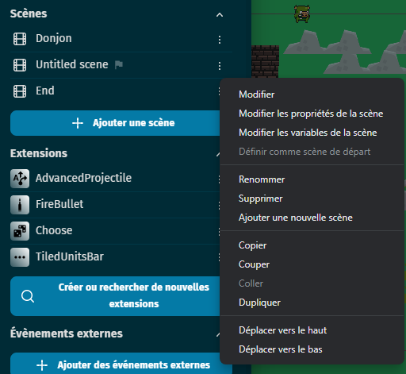
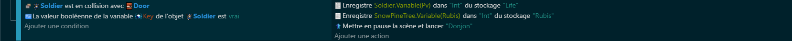

# Le coffre au trésor

Dans notre jeu, nous allons inclure un coffre au trésor que le joueur peut ouvrir pour obtenir des items. Un de ces items sera une épée, qui permettra au joueur d'attaquer les ennemis.

Pour mettre en place ce système, nous allons d'abord créer un objet pour le coffre au trésor. Lorsque le joueur interagit avec ce coffre, nous allons changer l'état du coffre pour indiquer qu'il est ouvert et nous allons donner l'épée au joueur.

Nous pourrions également inclure une animation pour montrer le coffre en train de s'ouvrir, et peut-être jouer un son pour rendre l'ouverture du coffre plus satisfaisante pour le joueur.

Pour ma part dans mon jeu, le coffre permet également d'ouvrir un passage de la carte d'où la variable éboulement dont je n'ai pas parlé.

# Le drop d'items aléatoire

En plus des coffres au trésor, nous allons également inclure un système de drop d'items aléatoire. Cela signifie que lorsque le joueur effectue certaines actions, comme casser de l'herbe, il a une chance de trouver un item.

Pour mettre en place ce système, nous allons d'abord déterminer quels items peuvent être trouvés en cassant de l'herbe. Ensuite, chaque fois que le joueur casse de l'herbe, nous allons générer un nombre aléatoire et utiliser ce nombre pour décider si un item doit être drop ou non, et lequel.

Cela ajoute un élément de surprise et d'excitation au jeu, car le joueur ne sait jamais ce qu'il va trouver en cassant de l'herbe.

## Conteneur a variable

Dans notre jeu, nous utilisons un objet appelé SnowPineTree comme conteneur pour stocker des variables. Cet objet n'est pas visible dans le jeu et est placé hors de la carte, mais il joue un rôle important dans le fonctionnement de notre système de drop d'items.

Lorsque le joueur coupe de l'herbe, nous enregistrons la position de l'herbe dans les variables KillPosX et KillPosY de SnowPineTree. Nous utilisons également SnowPineTree pour stocker un nombre aléatoire, généré chaque fois que de l'herbe est coupée, dans la variable Random.

Ensuite, lorsque nous décidons si un item doit être drop, nous vérifions la valeur de SnowPineTree.Random. Si cette valeur est 0, alors nous créons un objet Rupee à la position stockée dans SnowPineTree.KillPosX et SnowPineTree.KillPosY.

En utilisant SnowPineTree de cette manière, nous pouvons gérer efficacement le drop d'items aléatoires dans notre jeu.

En somme, les objets de type "conteneur de valeurs" sont un outil précieux pour tout développeur de jeux. Ils permettent de gérer efficacement des informations complexes et de garder le code du jeu propre et organisé.

## Étape 1 : Gérer la collision entre l'épée et l'herbe

Dans cette étape, nous vérifions si l'épée du joueur est en collision avec de l'herbe. Si c'est le cas et que le joueur n'a pas encore la clé, alors nous enregistrons la position de l'herbe dans les variables KillPosX et KillPosY de l'objet SnowPineTree (notre conteneur à variables), nous jouons un son pour indiquer que l'herbe a été coupée, nous supprimons l'herbe, et nous générons un nombre aléatoire entre 0 et 14 que nous stockons dans la variable Random de l'objet SnowPineTree.

## Étape 2 : Gérer le drop d'items

Dans cette étape, nous vérifions si la variable Random de l'objet SnowPineTree est égale à 0. Si c'est le cas, alors nous créons un objet Rupee à la position où l'herbe a été coupée, et nous réinitialisons la variable Random à -1 pour indiquer qu'un item a été drop. On répeteras ceci pour chaque item que l'on voudras placer.

## Étape 3 : Gérer la collecte d'items

Dans cette étape, nous vérifions si le joueur est en collision avec un objet. Si c'est le cas, alors nous supprimons l'objet, nous changeons la variable attaché a cet objet.

# La porte 🚪

Avant de codé la porte dupliquer votre scène de jeux afin de ne pas devoir tout recommencer de 0 et renommée la "donjon".

Dans cette étape, nous vérifions si le joueur est en collision avec une porte et si le joueur a la clé. Si c'est le cas, alors nous enregistrons les valeurs actuelles des points de vie du joueur et du nombre de rubis dans des fichiers (ce qui pourrait être utilisé pour sauvegarder l'état du jeu), et nous changeons la scène pour aller au donjon.

Félicitations à tous ! Nous avons maintenant un premier niveau avec un début et une fin. C'est une étape importante dans le développement de notre jeu. Vous avez fait du bon travail et je suis impatient de voir comment notre jeu va évoluer à partir de là. Alors, prêts pour le prochain défi ?

Dans les prochaines étapes de développement, nous allons explorer différentes idées pour les aléas de map et voir comment nous pouvons les intégrer dans notre jeu afin de le rendre plus vivant et intéressant.
