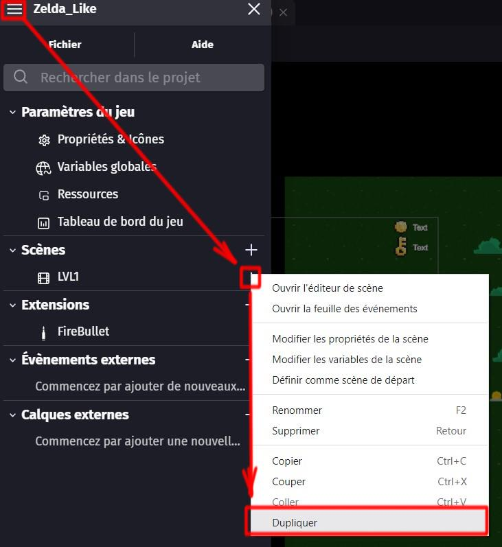
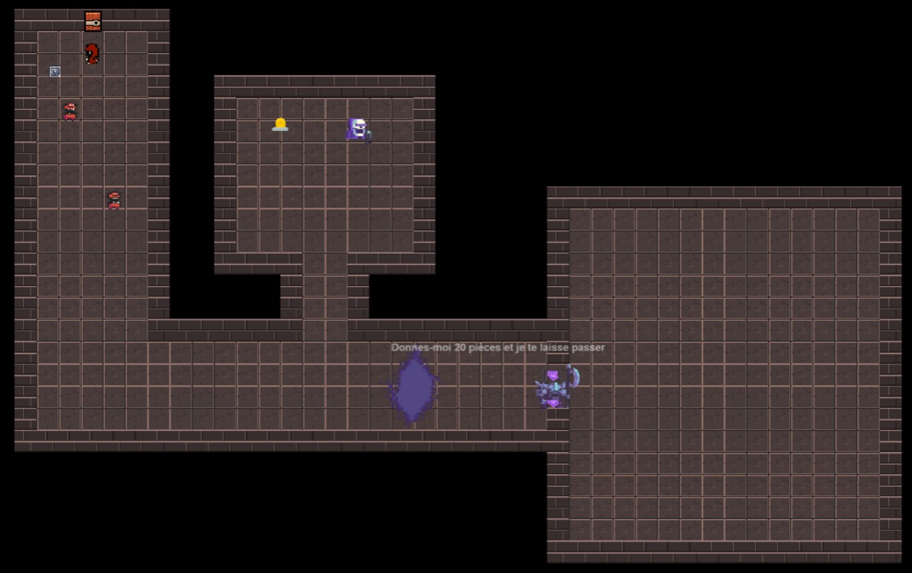
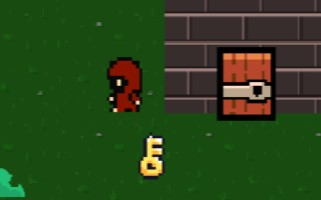
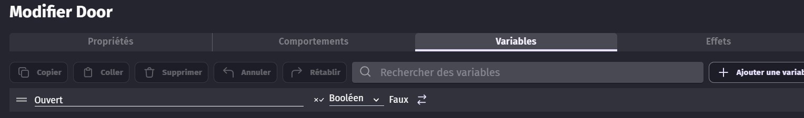
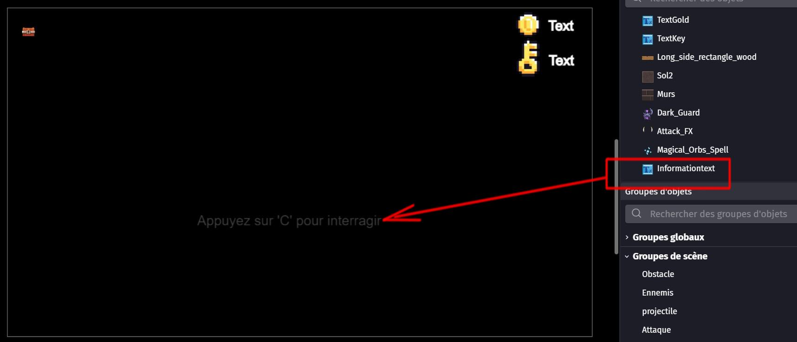
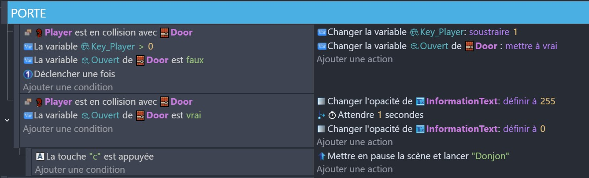
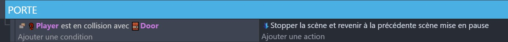
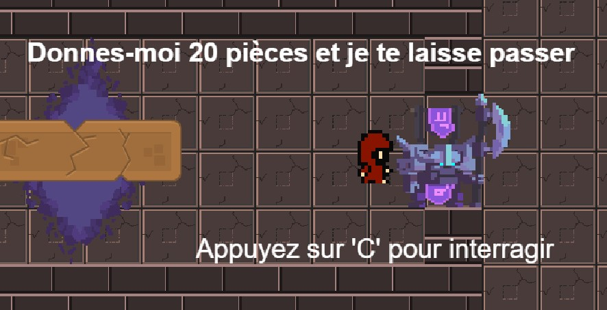
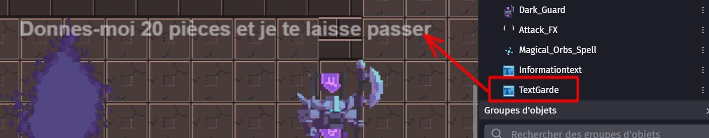
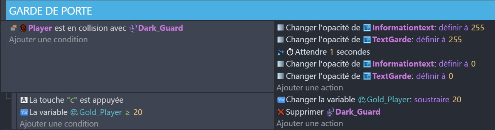

# 6 - Le Donjon

Désormais, nous pouvons considérer avoir tout les éléments en main pour avoir un niveau complet et fonctionnel. 

Il nous reste à rajouter l'étape finale : le Donjon 

Un donjon est un niveau de fin dans lequel le joueur va devoir affronter un boss. 

## Partie 1 - accéder au Donjon

### Nouveau niveau 

Nous allons créer un nouveau niveau pour notre donjon. 

Pour éviter de devoir recommencer tout le code du premier niveau, nous allons le **dupliquer**.

Le deuxième niveau est une copie exacte du premier. Il faut le renommer `Donjon` et le modifier : ajouter de nouveaux éléments de décors, changer le fond, .... 

Voici un exemple de donjon : 

### La porte à clé 

Pour pouvoir pénétrer dans le donjon, le joueur devra déverouiller une porte au moyen d'une clé. 

Lorsque le joueur entre en contact avec la porte, il ne peux rien faire tant qu'il n'a pas de clé.

Lorsqu'il a une clé, il déverrouille la porte, ce qui lui permet d'entrer.

Ajoutez une variable **Ouvert** à votre porte, pour savoir si elle est ouverte ou non.

Pour que le joueur puisse savoir comment interagir avec la porte, nous allons créer un texte d'`interaction` qui va lui indiquer quoi faire : 

Ensuite, Programmez la porte pour qu'elle s'ouvre lorsque le joueur lui apporte une clé. Une fois ouverte, le joueur peut passer au travers grâce à une touche d'interaction. 

## Partie 2 - Dans le donjon

Dans le donjon, nous allons ajouter quelques éléments supplémentaires pour le distinguer d'un niveau normal et faire qu'il fonctionne correctement. 

### Retour au niveau 1

Il est prévus de pouvoir retourner au niveau 1 en repassant par la porte d'entée. 

Voici le programme qui permet de revenir au niveau précédent. 

> Attention, cela enlève toute la progression dans le donjon !

### Le PNJ qui garde la porte 

Dans le donjon, un PNJ garde la porte. Il n'est pas dangereux, mais bloque le passage du joueur tant que ce dernier ne lui paie pas une rançon. 

Commençons par ajouter près du PNJ un texte `Textgarde` qui lui permettra de parler au joueur. 

Ensuite, ajoutons le programme pour que le PNJ puisse exprimer ses intentions au joueur, et qu'il puisse recevoir de l'argent de ce dernier pour ouvrir le passage. 

> La touche C est choisie car elle est proche de la barre d'espace, mais vous pouvez choisir n'importe quelle autre touche.

Testez votre programme pour vérifier que tout fonctionne. Lorsque le joueur possède 20 pièce et va voir le PNJ, il peut appuyer sur la touche `c` pour dépenser son argent et supprimer le Garde.

Avec ces nouveaux éléments, vous avez un niveau de donjon quasi-complet ! 

Il ne manque que la partie finale et la plus importante du jeu Zelda : un Boss.

