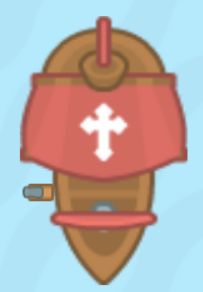
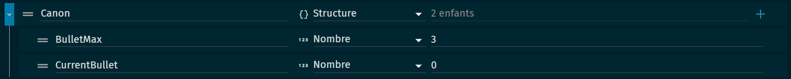

# Partie 1 : Le bouton qui crée un pont 🌉

Dans notre jeu, nous allons inclure un bouton que le joueur peut activer pour créer un pont. Ce pont peut être utilisé pour traverser une rivière ou un ravin, ou pour accéder à une zone autrement inaccessible.

Pour cela, on va récupérer un objet qui représentera un trou suite à cela, on lui créera une nouvelle animation puis on modifiera les masques de collision afin de préparer à arriver de notre pont.
Pour la première animation, on créera une box de collision qui rempliera le troue (il se peut que la collision soit déjà réalisée de base lorsque vous avez importé l'objet.). N'oubliez pas de décocher la case qui modifie la collision de toutes les animations.

Pour la deuxième animation essayer de séparer les collisions afin de faire un passage pour que notre personnage puisse passer. Placer le pont à l'endroit prévue a cette effet (entre les boxs de collision) et placer le en dessous du troue (Pour cela changer l'ordre Z de l'objet).

Pour mettre en place ce système, nous allons ensuite créer un objet pour le bouton. Lui créer une variable. Lorsque le joueur interagit avec ce bouton (par exemple, en entrant en collision avec le bouton), nous allons changer l'état du bouton pour indiquer qu'il a été activé et nous allons créer un pont à un endroit spécifique sur la carte.

# Partie 2 : Le bateau qui tire sur le joueur 🚤

En plus du bouton du pont, nous allons également inclure un bateau qui tire sur le joueur. Ce bateau pourrait être situé sur une rivière ou un lac, et il tirerait des projectiles sur le joueur à intervalles réguliers.

Pour mettre en place ce système, nous allons d'abord créer un objet pour le bateau.Ensuite on vas crée des variables de scène.

Nous allons ensuite programmer le bateau pour qu'il tire des projectiles à intervalles réguliers.

Cela ajoute un élément de défi au jeu, car le joueur doit éviter les projectiles tout en essayant de naviguer sur la carte. 🎯

Félicitations à tous ! Vous avez réussi à terminer le premier niveau de notre jeu. C'est une grande réalisation et vous devriez être fiers de vous. Continuez comme ça, et je suis sûr que vous allez créer un jeu incroyable. Allez, on passe au niveau suivant ! 💪

