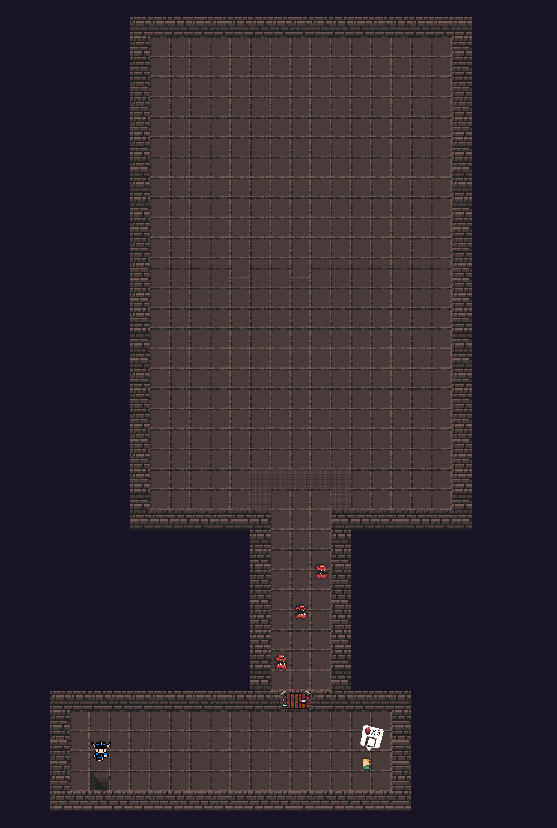
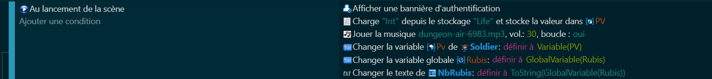
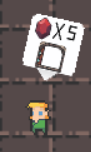
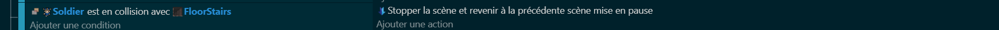

# Le donjon 🏰

Maintenant que nous avons terminé le premier niveau de notre jeu, il est temps de passer à l'ultime défi : le donjon. 🏰

Dans notre jeu, le donjon n'est pas une grande zone remplie d'énigmes et d'ennemis, mais plutôt une salle de boss(Prévoyez de la place). C'est ici que le joueur affrontera l'ennemi le plus puissant du niveau, dans un combat qui mettra à l'épreuve toutes les compétences qu'il a acquises jusqu'à présent.

La salle de boss sera conçue pour mettre en valeur les capacités du boss, avec peut-être des obstacles ou des mécanismes qui rendent le combat plus intéressant. Le joueur devra non seulement être capable de combattre efficacement, mais aussi de comprendre et de réagir aux différentes attaques et stratégies du boss.

Vaincre le boss sera une tâche difficile, mais la récompense en vaut la peine. Après avoir vaincu le boss, le joueur pourra progresser vers le prochain niveau et continuer son aventure.

Voici la liste de ce que vous aurez besoin pour cette partie:

> Mur 🧱 : Utilisé pour délimiter le terrain du donjon. Les murs empêchent le joueur de sortir de la zone de jeu.
> 
> Black Block ⬛ : Utilisé pour le fond du donjon. Cela donne à la salle de boss une apparence sombre et menaçante.
>
> Porte 🚪 : Une porte qui s'ouvre lorsque certaines conditions sont remplies, permettant au joueur d'accéder à la salle du boss.
>
> Boss "Gunman" 👾 : L'ennemi final du donjon. Le Gunman est un adversaire puissant qui tirera des projectiles sur le joueur.
>
> Projectile rond 🔵 : Un type de projectile que le boss peut tirer. Il se déplace en ligne droite et blesse le joueur s'il le touche.
>
> Projectile trait ➖ : Un autre type de projectile que le boss peut tirer. Il pourrait avoir un comportement différent du projectile rond, comme se déplacer en zigzag ou suivre le joueur.
>
> PNJ 🧑‍💼 : Un personnage non-joueur qui donne au joueur une indication sur la façon d'ouvrir la porte. Il pourrait être placé près de la porte ou à un autre endroit stratégique du donjon.
>
> Bulle de dialogue 💬 : Utilisée pour afficher le texte des indications données par le PNJ.
>
> Plateforme 🕹️ : Une plateforme spéciale qui indique si le joueur est dans la salle du boss ou non. Elle pourrait changer de couleur ou de forme pour indiquer l'état actuel de la salle.

Pour ce qui est de la map comme pour la scène d'avant libre à vous de réaliser comme vous le souhaitez. Voici mon exemple de la carte que j'ai réalisé.

# Code 💻

Pour le code, si vous avez correctement dupliqué la scène, il faudra supprimer tout ce qu'il ne nous intéresse pas ! On gardera alors :

> Notre personnage 🏃‍♂️ : Le code pour le personnage du joueur, qui gère les mouvements, les interactions et les combats du personnage.
>
>BigDemon 👹 : Le code pour le BigDemon, qui est probablement un ennemi ou un boss dans le donjon. Ce code gère les mouvements, les attaques et la santé du 
BigDemon.
>
>UI 🖥️ : Le code pour l'interface utilisateur (UI), qui affiche des informations importantes pour le joueur, comme la santé du personnage, le nombre de rubis collectés, etc.

# Debut de scène

Maintenant que nous avons préparé tous les éléments nécessaires pour notre donjon, il est temps de commencer à construire la scène du donjon. 🏰

La première chose que nous allons faire est de modifier le code du début de la scène. Au lieu de commencer avec des valeurs par défaut, nous allons charger les valeurs de la scène précédente. Cela signifie que l'état du joueur (comme la santé, le nombre de rubis, etc.) sera conservé d'une scène à l'autre.

Pour ce faire, nous allons utiliser les fichiers que nous avons créés précédemment pour enregistrer l'état du jeu. Lorsque la scène du donjon commence, nous allons lire ces fichiers et utiliser les valeurs qu'ils contiennent pour initialiser l'état du jeu.

Cela permet une transition en douceur entre les scènes et donne au joueur le sentiment que son progrès est reconnu et conservé.

# Porte a prix 🚪

## Partie 1 : L'animation et la collision de la porte 🚪

La première chose que nous allons faire pour notre porte payante est de créer une animation pour elle. Cette animation pourrait montrer une porte fermée et l'une ouverte lorsque le joueur a le nombre de rubis demandé.

Ensuite, nous allons configurer la collision pour la porte. La porte fermée aura une collision et si le joueur a assez de rubis alors la porte sera ouverte donc sans collision.

## Partie 2 : Les indications extérieures avec le PNJ et la bulle de dialogue 💬

Pour aider le joueur à comprendre comment fonctionne la porte payante, nous allons placer un PNJ à proximité qui donnera des indications au joueur.

Ces indications pourraient expliquer que la porte ne s'ouvre que si le joueur possède un certain nombre de rubis. Cela donne au joueur toutes les informations dont il a besoin pour utiliser la porte payante.

## Partie 3 : Le code 💻

Enfin, nous allons écrire le code qui gère toutes ces interactions. Ce code vérifiera si le joueur a assez de rubis pour ouvrir la porte, déduira le prix de la porte du total de rubis du joueur si c'est le cas, et jouera l'animation d'ouverture de la porte.

# Escalier

Dans notre donjon, nous allons inclure des escaliers qui serviront de moyen pour le joueur de retourner à la scène précédente. 🔄🏞️

Ces escaliers sont particulièrement utiles si le joueur n'a pas assez de rubis pour ouvrir la porte payante du donjon. En utilisant ces escaliers, le joueur peut retourner à la scène précédente pour collecter plus de rubis. 💰

Cela ajoute une dimension stratégique à notre jeu, car le joueur doit décider s'il vaut mieux avancer et affronter les défis du donjon avec les ressources qu'il a, ou s'il est préférable de retourner en arrière pour se préparer davantage.

De plus, cela donne au joueur plus de liberté et de contrôle sur son expérience de jeu, car il peut choisir quand et comment progresser dans le jeu.

