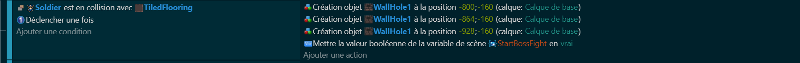
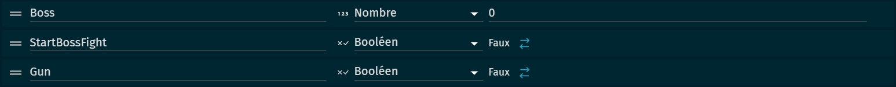

# Le boss (GunMan)

### Partie 1 : Fermeture des portes lors de l'entrée dans la salle du boss 🚪
Lorsque le joueur entre dans la salle du boss, nous voulons que les portes se ferment derrière lui. Cela crée une atmosphère de tension et indique au joueur qu'il est sur le point d'affronter un défi majeur. Pour réaliser cela, nous allons utiliser des objets "WallHole1" pour bloquer les entrées une fois que le joueur est à l'intérieur.

### Partie 2 : Variables de scène 📊
Pour cette partie, nous allons définir des variables qui nous aideront pour définir quand le combat commence et surtout définir quelle boss on fera face si on en a plusieurs.

Boss : Variable qui détermineras sur quelle boss on va devoir faire face.

StartBossFight : Celle-ci déterminera quand le combat commenceras.

Gun : Variable qui correspond au boss "GunMan".

### Partie 3 : Variables du boss 📊
Avant de créer le boss, nous devons définir certaines variables qui détermineront son comportement. Ces variables peuvent inclure la santé du boss, type de ses attaques, etc. En ajustant ces variables, nous pouvons contrôler la difficulté du combat contre le boss.

Direction : Cette variable détermine si le boss se déplace vers la gauche ou la droite. En changeant cette variable, nous pouvons faire changer de direction au boss.

Moved : Cette variable indique si le boss est en mouvement ou non. Si "Moved" est vrai, le boss se déplace. Si "Moved" est faux, le boss reste immobile.

Shoot : Cette variable indique si le boss est en train de tirer ou non. Si "Shoot" est vrai, le boss tire des projectiles. Si "Shoot" est faux, le boss ne tire pas.

Spécial : Cette variable indique si le boss utilise son attaque spéciale ou non. Si "Spécial" est vrai, le boss utilise son attaque spéciale. Si "Spécial" est faux, le boss utilise son attaque normale.

PV : Cette variable représente le nombre de points de vie du boss. Chaque fois que le boss est touché, nous déduisons un point de cette variable. Si "PV" atteint zéro, le boss meurt.

Pattern : Cette variable est un nombre aléatoire qui détermine si le boss utilise son attaque normale ou son attaque spéciale. En changeant cette variable, nous pouvons rendre le comportement du boss plus imprévisible et le combat plus intéressant.

### Partie 4 : Création du boss 👹
Ensuite, nous allons créer le boss que le joueur doit affronter. Nous avons plusieurs types de boss dans notre jeu, et le type de boss qui apparaît dépend de la variable de scène "Boss". Nous allons écrire du code qui crée le boss approprié en fonction de cette variable. Dans le projet on a pour l'instant que 1 seul boss donc placer la variable "Boss" a 1.

### Partie 5 : Mouvement du boss 🏃‍♂️
Un boss qui reste immobile serait trop facile à vaincre, donc nous allons programmer notre boss pour qu'il se déplace de gauche à droite. Pour éviter que le boss ne sorte de la salle, nous allons utiliser des objets "Collision" pour faire rebondir le boss lorsqu'il atteint les bords de la salle.

### Partie 6 : Attaquer le boss  🗡️
Bien sûr, notre boss doit être capable de se défendre. Nous allons donc écrire du code qui permet au boss de perdre des points de vie lorsqu'il est touché par l'épée du joueur et renvoyer le joueur en bas de la salle. Lorsque le boss n'a plus de points de vie, il joue une animation de mort, laisse tomber un objet "BookBlue", et est ensuite supprimé de la scène.

### Partie 7 : Gestion phase et Pv du Boss 🩸
Dans notre jeu, le boss a plusieurs phases, chacune correspondant à un certain nombre de points de vie. À chaque phase, le comportement du boss change, ce qui rend le combat plus difficile et plus intéressant.

### Partie 8 : Attaques spéciales du boss 💥
Pour rendre le combat contre le boss plus intéressant et plus difficile, nous allons programmer le boss pour qu'il utilise des attaques spéciales en plus de son attaque de base. Ces attaques spéciales peuvent être des lasers ou d'autres types de projectiles qui sont tirés en direction du joueur. Celle-ci sera définie par une variable "Patern" que nous avions définit plus haut.

Attaque de base : Un projectile rapide tiré en direction du joueur.

Attaque Spécial : une boule qui tourne sur elle-même et tire des projectiles qui suivront la rotation de la boule en spirale.

[END & Features](https://github.com/g404-code-gaming/Zelda-Like-CodeGaming/blob/main/Cr%C3%A9ation-Du-Jeu/09_End%2BFeatures.md)
